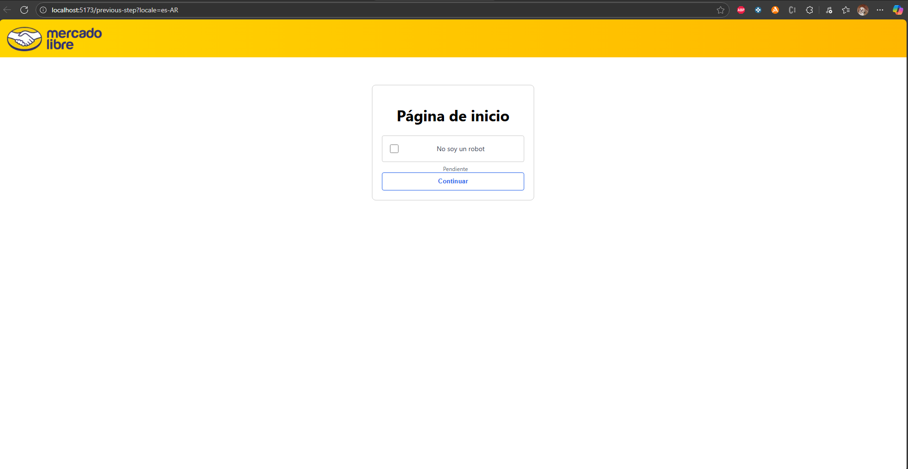
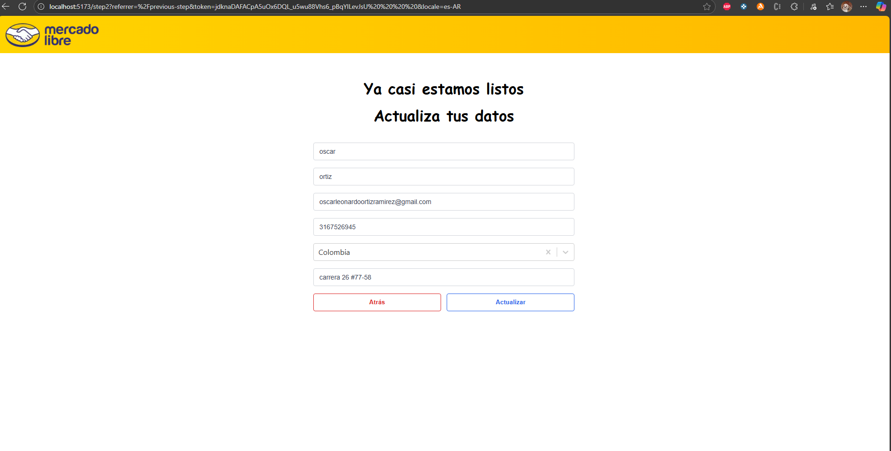
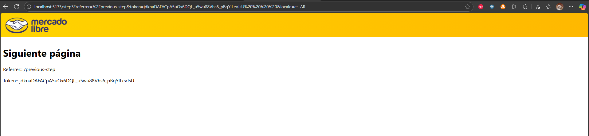
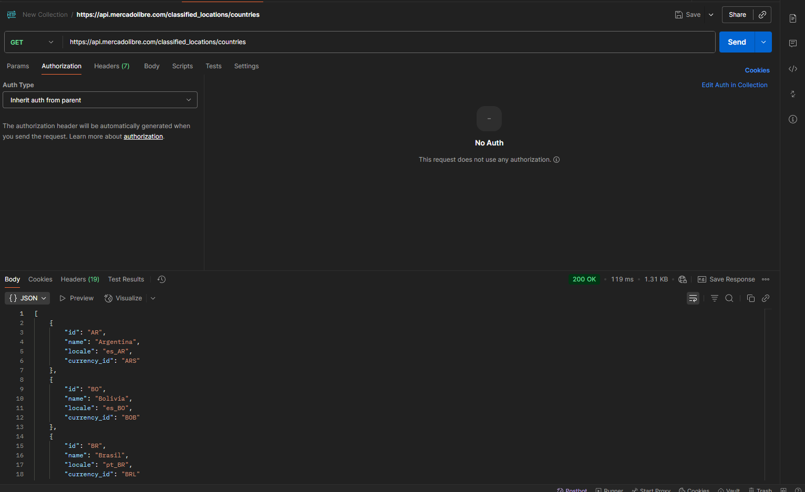
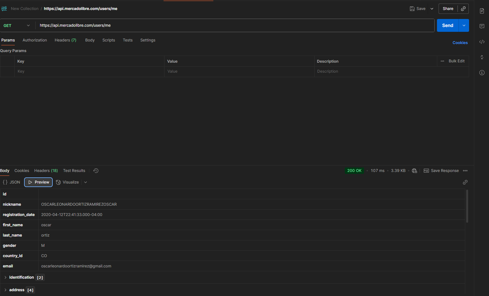
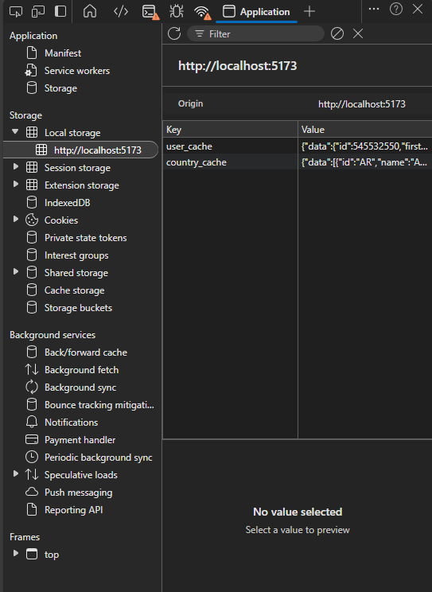

# mercado-libre-prueba

Prueba técnica para Mercado Libre.

## 🚀 Requerimientos

Para iniciar el proyecto:

```bash
npm install
```

Este proyecto utiliza **servicios con token de autenticación**.  
Puedes revisar la documentación oficial de Mercado Libre para obtener y gestionar tokens en el siguiente enlace:  
🔗 [Autenticación y autorización](https://developers.mercadolibre.com.co/es_ar/autenticacion-y-autorizacion)

---

## 📚 Documentación de APIs usadas

- **Paises y monedas:**  
  🔗 [Ubicación y monedas](https://developers.mercadolibre.com.co/es_ar/ubicacion-y-monedas#close)

- **Consulta de usuario:**  
  🔗 [Consulta de usuarios](https://developers.mercadolibre.com.co/es_ar/consulta-usuarios)

---

## 📝 Flujo de la aplicación

1. **Página previa (`/previous-step`)**
   - Muestra un ejemplo de **token** que es enviado en la URL junto con el **referrer**.
   - Ejemplo de URL:
     ```
     /previous-step?locale=es-AR&token=abc123&referrer=/previous-step
     ```

2. **Página formulario (`/step2`)**
   - Recibe `token` y `referrer` de la página anterior.
   - Obtiene la información del **usuario** y la lista de **países** mediante las APIs de Mercado Libre.
   - Si en la URL está presente el `token`, se muestra el **componente de ejemplo Captcha**.
   - Si **no** tiene `token` en la URL:
     - El Captcha no es visible.
     - El formulario genera un `token` propio y redirige a la siguiente página.

3. **Página de confirmación (`/step3`)**
   - Recibe el `token` proveniente de la **primera página** o del **Captcha** de la segunda página.
   - Muestra el **token** y el **referrer**.
   - Todas las páginas incluyen `locale` como parámetro para seleccionar el idioma.

---

## 🌐 Internacionalización

Todas las páginas manejan el parámetro `locale` en la URL para seleccionar el idioma de la interfaz.  
Ejemplos:
- `?locale=es-AR`
- `?locale=pt-BR`

---

## 📸 Pantallazos

### 📍 Página previa


### 📝 Página formulario


### ✅ Página confirmación


### LLamado api paises


### LLamado api user


### Cache primer llamado


### Cache segundo llamado


---

## 📌 Notas
- Asegúrate de contar con un **token válido** antes de iniciar las pruebas.
- Las llamadas a las APIs de Mercado Libre se realizan de forma autenticada (server-to-server).
- Se implementa **cache** para optimizar las solicitudes de países.
